# 어플리케이션 로드 밸런서

`어플리케이션 로드 밸런서`는 HTTP/HTTPS 트래픽을 리스너와 규칙 기준으로 처리하는 L7 로드 밸런서입니다. 하나의 진입점에서 호스트, 경로, 기본 작업을 조합해 여러 타겟 그룹으로 요청을 전달하거나, 리디렉션 또는 고정 응답을 반환할 수 있습니다.

## 화면 개요
- `생성 화면`: 기본 정보, 네트워크 정보, 리스너 정보, 기본 작업을 설정합니다.
- `목록 화면`: 로드 밸런서 현황을 조회하고 생성, 편집, 삭제 작업을 시작합니다.
- `상세 화면`: 기본 정보, 리스너 정보, 규칙 정보, 상태 정보를 확인합니다.
- `편집 화면`: 이름, 설명, 타입, IP 할당 방식을 수정합니다.
- `리스너 편집 화면`: 생성 후 리스너를 추가, 편집, 삭제합니다.
- `규칙 정보 화면`: 리스너별 조건, 작업, 우선 순위를 관리합니다.

## 사전 준비
### 네트워크와 리소스
- 프로젝트에 [`VPC`](../vpc/vpc.md)와 [`서브넷`](../subnet/subnet.md)이 준비되어 있어야 합니다.
- 요청을 전달할 [`어플리케이션 타겟 그룹`](../l7-target-group/l7-target-group.md)을 같은 VPC에 먼저 생성합니다.
- `타입: 외부`를 사용할 경우 [`외부 IP 주소`](../external-ip/external-ip.md)를 자동 할당하거나 수동 할당할 수 있어야 합니다.
- `타입: 외부` 로드 밸런서는 생성 대상 [`서브넷`](../subnet/subnet.md)이 프라이빗 서브넷이어도 [`외부 IP 주소`](../external-ip/external-ip.md)를 통해 외부에서 진입할 수 있습니다.
- HTTPS 리스너를 사용할 경우 SAN이 포함된 인증서 도메인과 UI에서 업로드할 PEM bundle 파일을 준비합니다. PEM bundle은 `key + cert` 형태여야 합니다.
- SNI 검증이 필요한 경우 클라이언트 DNS 또는 `/etc/hosts`에서 인증서 도메인이 로드 밸런서의 `외부 IP 주소`로 해석되도록 준비합니다.

### 네트워크 보안 정책
Cloudia L4/L7 로드 밸런서는 로드 밸런서와 타겟이 서로 다른 서브넷에 위치해도 NACL을 적용받지 않습니다. 따라서 로드 밸런서 사용 전제 조건에서 NACL은 검토 대상이 아니며, 타겟 서버에 연결된 [`보안그룹`](../../security/security-group/security-group.md)에서 `클라이언트 -> 타겟` 트래픽을 허용하는 정책을 수립합니다.

예시 조건:
- 서비스 클라이언트 CIDR: `10.20.0.0/16`
- 서비스 포트: `8080`
- 상태 검사 포트: `8080` 또는 별도 포트

| 방향 | 프로토콜 | 포트 | 소스 | 설명 |
| --- | --- | --- | --- | --- |
| 인바운드 | TCP | 8080 | 10.20.0.0/16 | 클라이언트의 어플리케이션 트래픽 허용 |
| 인바운드 | TCP | 18080 | 10.20.0.0/16 | 상태 검사 포트를 분리한 경우만 추가 |

- 소스 CIDR은 실제 서비스 클라이언트 또는 운영상 허용한 접근 구간으로 대체합니다.
- 보안그룹은 상태 저장 방식이므로 허용된 인바운드 트래픽의 응답은 자동 허용됩니다.
- 운영 정책상 아웃바운드를 제한 중이라면 애플리케이션이 실제로 필요로 하는 목적지와 포트만 별도로 허용합니다.

## 로드 밸런서 생성
### 화면 예시
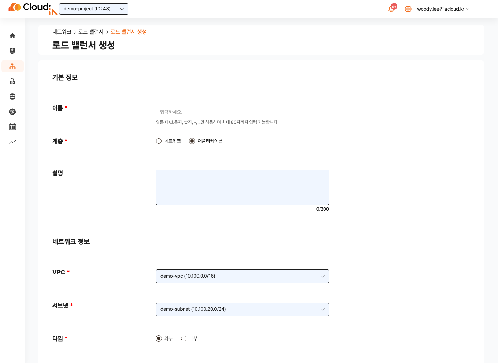

### 기본 정보
1. `프로젝트 > 네트워크 > 로드 밸런서`로 이동합니다.
2. `생성`을 클릭합니다.
3. `이름`을 입력합니다.
4. `계층`에서 `어플리케이션`을 선택합니다.
5. 필요한 경우 `설명`을 입력합니다.

### 네트워크 정보
1. `VPC`를 선택합니다.
2. `서브넷`을 선택합니다.
3. `타입`을 선택합니다.
4. `내부 IP 주소` 할당 방식을 선택합니다.
5. `타입: 외부`인 경우 `외부 IP 주소` 할당 방식을 선택합니다.

입력 시 다음 사항을 확인합니다.

- 리스너가 이미 추가된 상태에서는 VPC를 변경할 수 없습니다. VPC를 바꾸려면 먼저 리스너를 제거합니다.
- `타입: 내부`를 선택하면 `외부 IP 주소` 입력은 비활성화됩니다.
- `타입: 외부`는 선택한 서브넷의 퍼블릭/프라이빗 여부와 관계없이 `외부 IP 주소`를 통해 외부 진입점으로 동작합니다.

### 리스너 정보
1. `리스너 정보`에서 `추가`를 클릭합니다.
2. `프로토콜`을 선택합니다. L7 리스너는 `HTTP`, `HTTPS`를 사용할 수 있습니다.
3. `포트 번호`를 입력합니다.
4. 필요한 경우 `설명`을 입력합니다. `다음` 버튼을 눌러 `기본 작업` 설정으로 넘어갑니다.
5. `기본 작업`을 설정합니다.
6. HTTPS 리스너를 선택한 경우, `HTTPS 인증서`를 등록합니다.
7. 리스너를 저장합니다.

리스너 제약:
- 리스너는 최소 1개 이상 필요합니다.
- 하나의 로드 밸런서에 최대 10개까지 추가할 수 있습니다.
- `포트 번호`는 `1-65535` 범위의 정수입니다.
- 같은 로드 밸런서 안에서 동일한 포트 번호를 중복 사용할 수 없습니다.

### 기본 작업
리스너는 어떤 규칙에도 매칭되지 않은 요청을 처리하기 위해 `기본 작업`이 필요합니다.
선택한 작업에 따라 입력 항목이 달라지므로, 목적에 맞는 작업을 먼저 선택한 뒤 세부 값을 입력합니다.

#### 타겟 그룹으로 전달
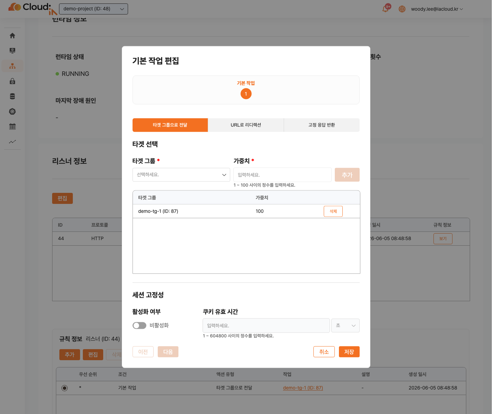

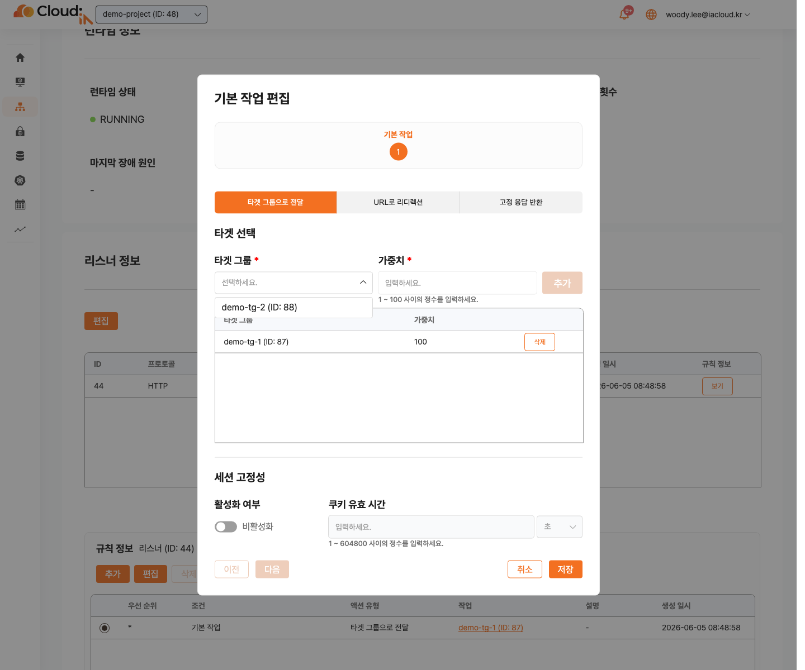

- 최대 5개의 타겟 그룹을 선택할 수 있습니다.
- 각 타겟 그룹의 `가중치`는 `1-100` 범위로 입력합니다.
- 기존에 선택된 타겟 그룹은 하단 목록에 표시되고, 추가 가능한 같은 VPC의 타겟 그룹은 드롭다운 후보로 표시됩니다.
- 이미 같은 로드 밸런서에 연결된 타겟 그룹은 같은 로드 밸런서의 다른 리스너 또는 규칙에서 재사용할 수 있습니다.
- 이미 다른 로드 밸런서에 연결된 타겟 그룹은 현재 로드 밸런서의 후보에서 제외됩니다.
- `세션 고정성`을 활성화하면 `쿠키 유효 시간`을 입력합니다.
- 리스너 작업의 `세션 고정성`은 여러 타겟 그룹 중 선택된 타겟 그룹을 브라우저 세션별로 고정하는 기능입니다. 쿠키가 삭제되거나 만료되면 타겟 그룹이 다시 선택될 수 있습니다.

#### URL로 리디렉션
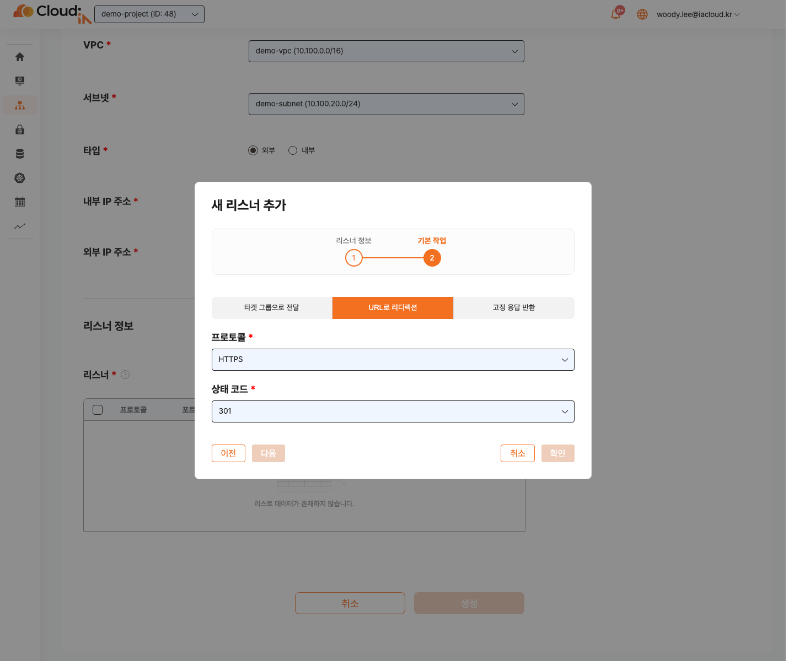

- `프로토콜`은 `HTTP` 또는 `HTTPS`를 선택합니다.
- `상태 코드`는 `301` 또는 `302`를 선택합니다.
- HTTP에서 요청을 HTTPS로 전환할 때 사용합니다.

#### 고정 응답 반환
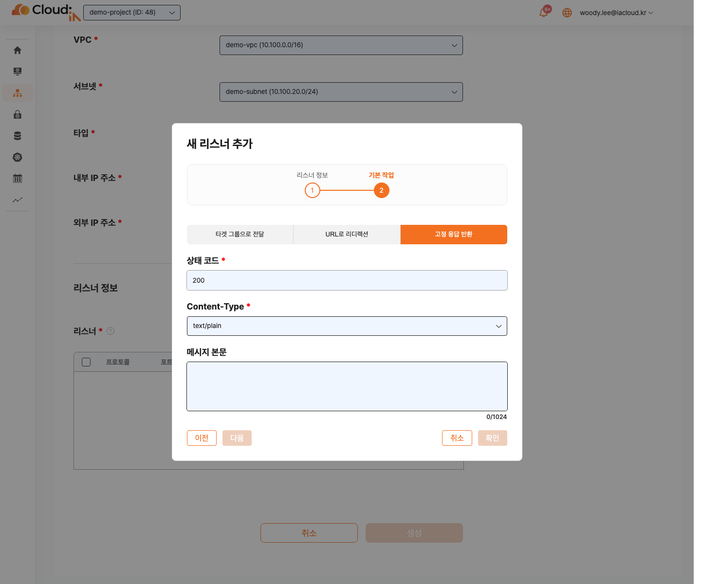

- `상태 코드`는 2xx, 4xx, 5xx 계열 값을 사용합니다.
- `Content-Type`과 `메시지 본문`을 입력합니다.
- `메시지 본문`은 최대 1024자까지 입력할 수 있습니다.
- 점검 페이지, 차단 응답, 기본 응답을 반환할 때 사용합니다.

### HTTPS 인증서
HTTPS 리스너를 선택하면 인증서 설정이 필요합니다.

- `기본 인증서 파일`은 1개가 필수입니다.
- 인증서 파일은 `.pem` 형식의 `key + cert` bundle이어야 합니다.
- `SNI 인증서 파일`은 최대 25개까지 추가할 수 있습니다.
- SNI 인증서를 추가할 때는 `호스트 이름`을 함께 입력합니다.
- 인증서의 SAN DNS와 `호스트 이름`이 일치해야 합니다.
- 클라이언트에서 해당 도메인이 로드 밸런서의 `외부 IP 주소`로 해석되어야 정상 검증할 수 있습니다.

### 생성 버튼 활성화 조건
- 필수 입력 항목이 모두 유효해야 합니다.
- 리스너가 1개 이상 있어야 합니다.
- HTTPS 리스너가 있으면 인증서 입력이 유효해야 합니다.

## 로드 밸런서 목록
### 화면 예시
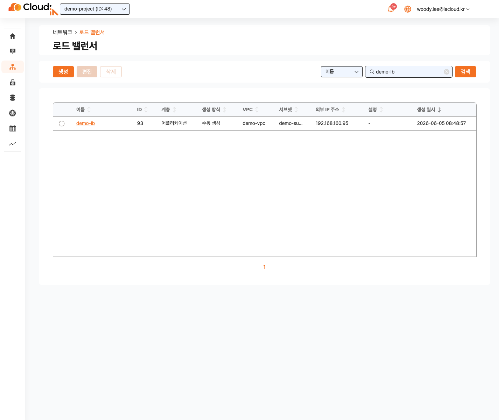

### 주요 작업
- `생성`: 새 로드 밸런서를 생성합니다.
- `편집`: 선택한 1개 로드 밸런서를 편집합니다. 수동 생성 리소스만 편집할 수 있습니다.
- `삭제`: 선택한 로드 밸런서를 삭제합니다. 수동 생성 리소스만 삭제할 수 있습니다.

### 테이블 컬럼
| 컬럼 | 설명 |
| --- | --- |
| **이름** | 로드 밸런서 이름입니다. 클릭하면 상세 화면으로 이동합니다. |
| **ID** | 로드 밸런서 고유 ID입니다. |
| **계층** | `네트워크` 또는 `어플리케이션`입니다. L7 로드 밸런서는 `어플리케이션`으로 표시됩니다. |
| **생성 방식** | `수동 생성`, `쿠버네티스`, `오토 스케일링 그룹` 등 프로비저닝 소스입니다. |
| **VPC** | 소속 VPC 이름입니다. |
| **서브넷** | 내부 IP 주소가 할당된 서브넷 이름입니다. |
| **외부 IP 주소** | 외부 타입일 때 할당된 외부 IP 주소입니다. |
| **설명** | 로드 밸런서 설명입니다. |
| **생성 일시** | 로드 밸런서가 생성된 날짜와 시각입니다. |

### 버튼 활성화 기준
- 항목을 선택하지 않으면 `편집`, `삭제` 버튼이 비활성화됩니다.
- 수동 생성 항목 1개를 선택하면 `편집`, `삭제` 버튼이 활성화됩니다.
- 시스템 생성 항목은 `편집`, `삭제` 버튼이 비활성화될 수 있습니다.

## 로드 밸런서 상세
### 상세 정보
상세 화면의 상단에서는 로드 밸런서의 상세 정보를 확인합니다.

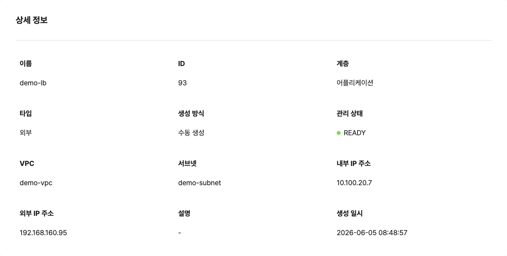

기본 정보에서 다음 항목을 확인합니다.

- **이름**: 로드 밸런서 이름입니다.
- **ID**: 로드 밸런서 고유 ID입니다.
- **계층**: `어플리케이션`인지 확인합니다.
- **타입**: `외부` 또는 `내부`입니다.
- **VPC**: 로드 밸런서가 속한 VPC입니다.
- **서브넷**: 내부 IP 주소가 할당된 서브넷입니다.
- **내부 IP 주소**: 내부 통신에 사용하는 IP 주소입니다.
- **외부 IP 주소**: 외부 타입에서 외부 접근 지점으로 사용하는 IP 주소입니다.
- **생성 방식**: 수동 생성 또는 시스템 생성 여부입니다.
- **관리 상태**: 로드 밸런서의 관리 상태입니다.
- **설명**: 운영 메모입니다.
- **생성 일시**: 생성된 날짜와 시각입니다.

런타임 정보 영역에서는 실제 런타임 관측 결과와 장애 감지 정보를 확인합니다.

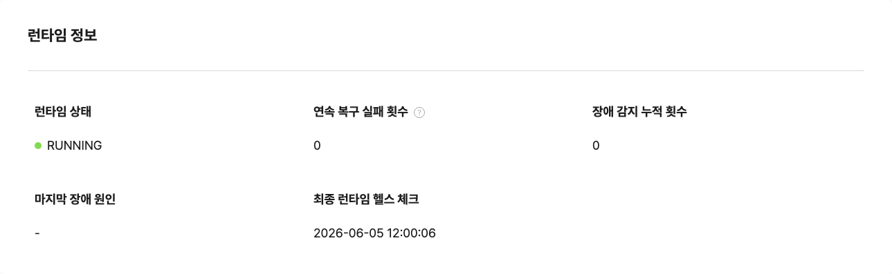

런타임 정보에서 다음 항목을 확인합니다.

- **런타임 상태**: 실제 헬스체크가 수행한 L7 로드밸런서 관측 결과입니다.
- **연속 복구 실패 횟수**: 런타임 장애 복구를 연속으로 실패한 횟수입니다. 3회까지 자동 복구를 시도하고, 그 이후부터는 수동으로 재배포를 해야 합니다.
- **장애 감지 누적 횟수**: 런타임 장애가 감지된 누적 횟수입니다.
- **마지막 장애 원인**: 마지막으로 감지된 장애 원인입니다.
- **최종 런타임 헬스 체크**: 런타임 상태를 마지막으로 확인한 시각입니다.


### 관리 상태와 런타임 상태
로드 밸런서 상태는 `관리 상태`와 `런타임 상태`를 구분해서 봅니다.

- `관리 상태`: 로드 밸런서 설정을 생성, 수정, 삭제, 페일오버 반영하는 오케스트레이션 상태입니다. 일반 수정 가능 여부를 판단하는 기준입니다.
- `런타임 상태`: 실제 로드밸런서 런타임 상태 확인 결과입니다. 장애 감지, 자동 복구, 재배포 판단에 사용합니다.

상세 화면의 `상태`는 관리 상태이고, `런타임 정보 > 런타임 상태`는 실제 런타임 동작 상태입니다. `관리 상태=READY`여도 `런타임 상태`가 `RUNNING`이 아니면 런타임 장애 또는 복구 중 상태로 판단하고 재배포 또는 원인 점검을 검토합니다.

#### 관리 상태
| UI 표시명 | 상세 설명 |
| --- | --- |
| READY | 적용 중인 작업이 없고 설정이 정상 반영된 상태입니다. 일반 수정 작업을 진행할 수 있습니다. |
| APPLYING_CREATE | 로드 밸런서 생성 작업을 적용하는 중입니다. 작업 완료 전까지 추가 변경이 제한될 수 있습니다. |
| APPLYING_UPDATE | 로드 밸런서 설정 변경을 적용하는 중입니다. 리스너, 규칙, 인증서, 타겟 그룹 변경 반영이 포함될 수 있습니다. |
| APPLYING_DELETE | 로드 밸런서 삭제 작업을 적용하는 중입니다. 삭제 완료 전까지 조작이 제한됩니다. |
| FAILOVER_APPLYING | 페일오버 또는 동기화 작업으로 로드 밸런서 설정을 다시 반영하는 중입니다. |
| APPLY_FAILED | 설정 적용 또는 롤백에 실패한 상태입니다. 일반 수정은 제한되며 삭제 또는 재배포 절차를 검토합니다. |

#### 런타임 상태
| UI 표시명 | 상세 설명 |
| --- | --- |
| RUNNING | 로드 밸런서 런타임 응답이 정상인 상태입니다. |
| RECOVERING | 런타임 응답 실패가 감지되어 자동 복구를 시도하거나 대기 중인 상태입니다. |
| RUNTIME_FAILED | 자동 복구 한계에 도달했거나 런타임 복구 실패가 확정된 상태입니다. 재배포 절차를 검토합니다. |
| UNKNOWN | 초기 상태이거나 아직 probe가 수행되지 않아 런타임 상태를 판단할 수 없는 상태입니다. |


### 리스너 정보
리스너 정보 목록에서는 리스너별 설정과 규칙을 확인합니다.

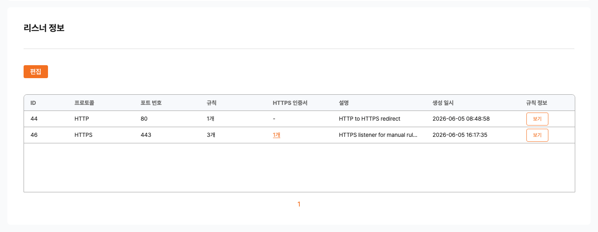

| 컬럼 | 설명 |
| --- | --- |
| **ID** | 리스너 ID입니다. |
| **프로토콜** | `HTTP` 또는 `HTTPS`입니다. |
| **포트 번호** | 클라이언트가 접속하는 리스너 포트입니다. |
| **규칙** | `규칙 정보` 화면에 표시되는 행 수입니다. 기본 작업 행을 포함해 표시됩니다. |
| **HTTPS 인증서** | HTTPS 리스너에 연결된 인증서입니다. 셀을 통해 인증서 목록과 기본 인증서를 확인합니다. |
| **설명** | 리스너 설명입니다. |
| **생성 일시** | 리스너 생성 시각입니다. |

## 규칙 정보 관리
### 규칙 화면 진입
1. 로드 밸런서 생성 후 상세 화면으로 이동합니다.
2. `리스너 정보`에서 대상 리스너 행을 확인합니다.
3. `규칙 정보 > 보기`를 클릭합니다.

### 규칙 추가와 편집
규칙은 `조건`, `작업`, `우선 순위` 순서로 설정합니다.

### 조건
- `조건 유형`은 `호스트 헤더` 또는 `경로`를 사용합니다.
- 하나의 규칙에서 `호스트 헤더`와 `경로`는 각각 1개씩만 사용할 수 있습니다.
- 같은 조건 안에 여러 값을 넣으면 `또는(OR)` 조건으로 처리됩니다.
- 서로 다른 조건은 `그리고(AND)` 조건으로 처리됩니다.

### 작업
규칙 작업은 리스너의 기본 작업과 동일하게 다음 중 하나를 선택합니다.

- `타겟 그룹으로 전달`
- `URL로 리디렉션`
- `고정 응답 반환`

### 우선 순위
- 규칙은 위에서 아래 순서로 평가됩니다.
- 규칙 왼쪽의 삼선 버튼을 드래그 앤 드롭하여 우선 순위를 조정합니다.
- `기본 작업`은 `*` 행으로 표시되며, 어떤 규칙에도 매칭되지 않을 때 적용됩니다.

### 규칙 작성 예시
| 목적 | 조건 | 작업 |
| --- | --- | --- |
| HTTP to HTTPS 전환 | HTTP 리스너 기본 작업 | `URL로 리디렉션(HTTPS, 301)` |
| 호스트 기반 분기 | HTTPS 리스너: `호스트 헤더 = test.iacloud.kr` | `타겟 그룹으로 전달(demo-tg-1)` |
| 경로 기반 분기 | HTTPS 리스너: `경로 = /api/` | `타겟 그룹으로 전달(demo-tg-2)` |
| 기본 차단 응답 | HTTPS 리스너 기본 작업 | `고정 응답 반환(403)` |

선택한 리스너에 따라 규칙 정보 화면에 표시되는 조건과 작업이 달라집니다. 아래 예시는 HTTP 리스너의 기본 작업을 `URL로 리디렉션`으로 설정해 HTTP 요청을 HTTPS로 전환하는 구성입니다.

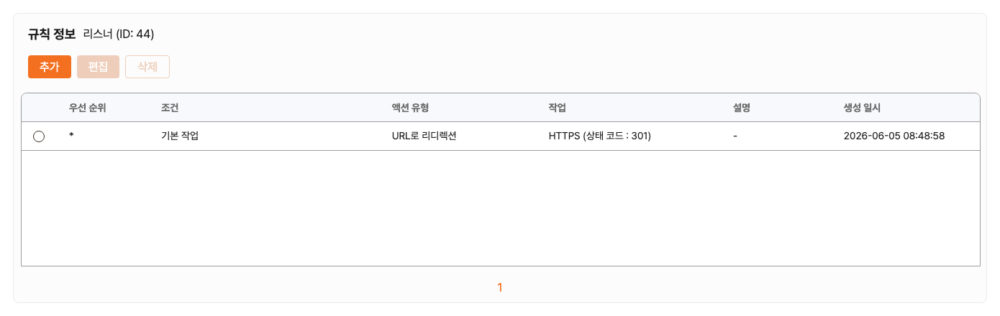

예시에서 HTTPS 리스너는 호스트/경로 기반 규칙을 먼저 평가하고, 어떤 규칙에도 매칭되지 않은 요청은 기본 작업으로 처리하도록 구성할 수 있습니다.

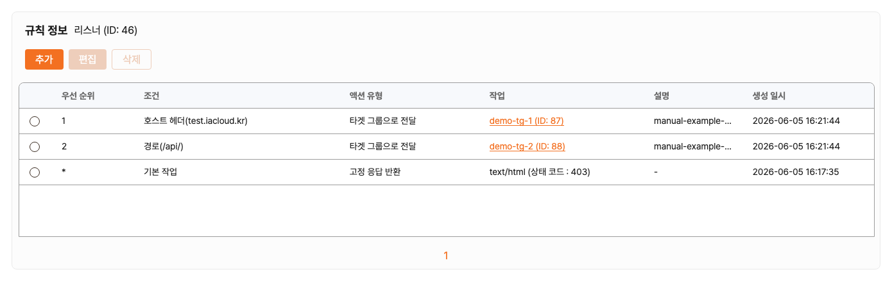


## 설정 변경
### 기본 정보 편집
목록에서 수동 생성 로드 밸런서 1개를 선택한 뒤 `편집`을 클릭합니다.

편집 가능한 항목:
- `이름`
- `설명`
- `타입`
- `내부 IP 주소`
- `외부 IP 주소`

편집 시 참고 사항:
- `내부 IP 주소`는 같은 VPC/서브넷에서 사용 가능한 IP 후보 중 선택합니다.
- `타입: 외부`의 `외부 IP 주소`는 할당 가능한 외부 IP 후보 중 선택합니다.
- 이름, 설명, IP 정보를 변경해도 기존 리스너, 규칙, 타겟 그룹 구성은 유지됩니다.

### 리스너 변경
로드 밸런서 상세 화면에서 리스너 편집 화면으로 이동해 리스너를 추가, 편집, 삭제합니다.

- 리스너 변경은 서비스 진입 포트와 전달 대상에 직접 영향을 줍니다.
- 운영 중에는 트래픽 영향 시간대를 확인한 뒤 변경합니다.
- HTTPS 리스너 변경 시 인증서와 도메인 해석을 함께 점검합니다.

## 재배포
상세 화면의 `재배포` 버튼으로 L7 로드 밸런서 설정과 런타임을 다시 반영할 수 있습니다.

1. 재배포 전 `관리 상태`와 `런타임 상태`를 확인합니다.
2. `재배포`를 클릭합니다.
3. 처리 중 상태 전이를 확인합니다.
4. 정상 재배포 후 `관리 상태=READY`, `런타임 상태=RUNNING`으로 복귀하는지 확인합니다.

`런타임 상태=RUNTIME_FAILED`인 경우 원인 조치 후 수동 재배포로 복구를 시도할 수 있습니다. 재배포가 완료되기 전에는 중복 변경을 피합니다.

## 모니터링
- 상세 정보에서 로드 밸런서의 `관리 상태`를 확인합니다.
- 상세 화면의 `런타임 정보`에서 `런타임 상태`, `연속 복구 실패 횟수`, `장애 감지 누적 횟수`, `마지막 장애 원인`, `최종 런타임 헬스 체크`를 확인합니다.
- `관리 상태`는 설정 적용 상태를 의미하고, `런타임 상태`는 실제 로드밸런서 런타임 상태를 의미합니다.
- `관리 상태=READY`이면 설정 적용은 완료된 상태입니다. 다만 `런타임 상태`가 `RUNNING`이 아니면 실제 트래픽 처리 런타임에는 장애, 복구 중, 또는 미확인 상태가 있을 수 있습니다.
- `런타임 상태=RUNNING`이면 런타임 응답이 정상인 상태입니다.
- `런타임 상태=RECOVERING`이면 런타임 장애 감지 후 자동 복구를 시도하거나 대기 중인 상태입니다.
- `런타임 상태=RUNTIME_FAILED`이면 자동 복구 한계에 도달했거나 런타임 복구 실패가 확정된 상태입니다.
- `런타임 상태=UNKNOWN`이면 초기 상태이거나 아직 probe가 수행되지 않아 런타임 상태를 판단할 수 없는 상태입니다.
- `리스너 정보`에서 각 리스너의 규칙과 인증서 구성을 확인합니다.
- `규칙 정보 > 보기`에서 조건과 작업이 의도대로 구성되었는지 확인합니다.
- 연결된 타겟 그룹의 타겟 상태는 타겟 그룹 상세 화면의 `연결된 리소스 > 타겟 > 모니터링 정보 > 보기`에서 확인합니다.

## 삭제
### 삭제 전 확인 사항
- 연결된 서비스 영향 범위를 확인합니다.
- 대체 진입점이 필요한지 확인합니다.

### 삭제 절차
1. 목록에서 삭제할 로드 밸런서를 선택합니다.
2. `삭제`를 클릭합니다.
3. 삭제 확인 모달에서 `이름`, `ID`, `VPC`, `서브넷`, `외부 IP 주소`, `설명`을 확인합니다.
4. 삭제를 실행합니다.

수동 생성 로드 밸런서만 삭제할 수 있습니다. 시스템 생성 로드 밸런서는 삭제 버튼이 비활성화될 수 있습니다.

## 검증 절차
### 생성 검증
1. `로드 밸런서` 목록에서 새 항목의 `계층`이 `어플리케이션`인지 확인합니다.
2. `생성 방식`, `VPC`, `서브넷`, `외부 IP 주소`가 의도한 값인지 확인합니다.
3. 상세 화면에서 `관리 상태=READY`, `런타임 상태=RUNNING`인지 확인합니다.
4. `리스너 정보`에 설정한 `프로토콜`, `포트 번호`, `HTTPS 인증서`가 표시되는지 확인합니다.

### 트래픽 검증
브라우저 또는 `curl`로 로드 밸런서 진입점을 확인합니다.

```bash
curl -i http://<외부 IP 주소>:<리스너 포트>/
```

HTTPS 리스너와 인증서 도메인을 검증할 때는 도메인이 로드 밸런서의 `외부 IP 주소`로 해석되도록 준비한 뒤 확인합니다.

```bash
curl -I http://<외부 IP 주소>/
curl -k --resolve test.iacloud.kr:443:<외부 IP 주소> https://test.iacloud.kr/
curl -k --resolve test.iacloud.kr:443:<외부 IP 주소> https://test.iacloud.kr/api/
curl -k https://<외부 IP 주소>/
```

확인 기준:
- `타겟 그룹으로 전달`: 타겟 애플리케이션 응답이 반환됩니다.
- `URL로 리디렉션`: 설정한 `301` 또는 `302` 응답과 Location 헤더가 반환됩니다.
- `고정 응답 반환`: 설정한 상태 코드, Content-Type, 메시지 본문이 반환됩니다.
- 전달 규칙이 매칭되어도 타겟이 비정상 상태이거나 응답 가능한 멤버가 없으면 503 응답이 반환될 수 있습니다. 이 경우 타겟 그룹 상세의 타겟 상태를 함께 확인합니다.

### 규칙 검증
1. 호스트 헤더 조건을 사용하는 경우 다른 Host 값으로 요청해 분기 결과를 비교합니다.
2. 경로 조건을 사용하는 경우 `/api/`, `/`, 미등록 경로 등으로 요청해 우선 순위가 의도대로 적용되는지 확인합니다.
3. 어떤 규칙에도 매칭되지 않는 요청이 `기본 작업`으로 처리되는지 확인합니다.

### 보안 정책 검증
1. 타겟 서버 보안그룹에서 `클라이언트 -> 타겟` 서비스 포트가 허용되어 있는지 확인합니다.
2. 상태 검사 포트를 서비스 포트와 다르게 사용한다면 해당 포트도 허용되어 있는지 확인합니다.
3. NACL은 Cloudia L4/L7 로드 밸런서의 사전 검토 대상이 아니므로 보안그룹 정책을 우선 점검합니다.

### 재배포 검증
1. 리스너, 규칙, 인증서, 타겟 그룹 설정을 변경합니다.
2. 상세 화면에서 `재배포`를 실행합니다.
3. 완료 후 `관리 상태=READY`, `런타임 상태=RUNNING`으로 복귀하는지 확인합니다.
4. 실제 HTTP/HTTPS 요청 결과가 변경된 설정과 일치하는지 확인합니다.

## 연관 기능 문서
- [어플리케이션 타겟 그룹](../l7-target-group/l7-target-group.md)
- [로드 밸런서](../load-balancer/load-balancer.md)
- [타겟 그룹](../target-group/target-group.md)
- [보안그룹](../../security/security-group/security-group.md)
- [VPC](../vpc/vpc.md)
- [서브넷](../subnet/subnet.md)
- [외부 IP](../external-ip/external-ip.md)
- [프라이빗 DNS](../private-dns/private-dns.md)
